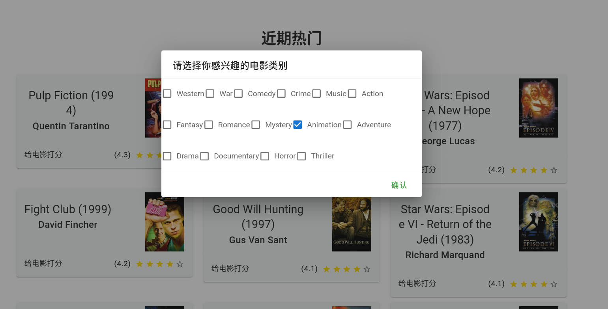

# 系统架构

# 使用说明
## 注册

## 登录

## 冷启动

## 热门电影

## 排行榜

## 实时推荐

## 离线推荐

## 后端
- Spring
- MongoDB
在推荐系统中多为半结构化、非结构化数据，使用MongoDB便于存储
- Redis
- ElasticSearch

## 前端
使用了 Vue + Vuetify，详情见
[推荐系统前端](https://github.com/EnableAsync/recommender-frontend)